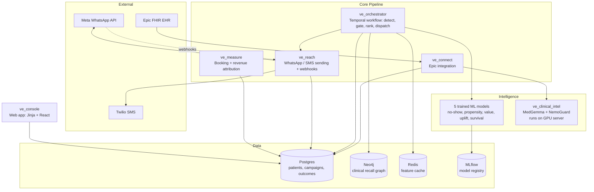

# Velo Engage — Architecture Overview

## What it is

Velo Engage is a patient-reactivation platform for outpatient clinics. It
automatically finds patients who have a legitimate reason to come back,
checks they can be legally contacted, decides whether contacting them is
worth it, reaches them on WhatsApp, and measures whether it actually
worked — running once a day, per clinic.

## System architecture

## Where each module lives

| Service | Location | Responsibility |
| --- | --- | --- |
| `ve_orchestrator` | `services/ve_orchestrator/` | Temporal workflow: detection, guardrails, ranking, dispatch |
| `ve_connect` | `services/ve_connect/` | Epic FHIR integration — patient data and clinical notes |
| `ve_reach` | `services/ve_reach/` | WhatsApp/SMS sending, inbound webhooks, reply intent |
| `ve_measure` | `services/ve_measure/` | Booking and revenue attribution from real-world events |
| `ve_console` | `services/ve_console/` | Web app (Jinja + React), both serving the same API |
| `ve_clinical_intel` | `services/ve_clinical_intel/` | MedGemma/NemoGuard note extraction (runs on a GPU server) |
| ML training & registry | `ml/` | Training scripts, MLflow registry wrappers used at ranking time |
| Business rules | `policies/opportunities/*.yml` | The 16 opportunity families, defined as data, not code |
| Database schema | `infra/migrations/` | Postgres schema, applied in order |

## How services communicate

- **Postgres is the shared source of truth** — most services read and
  write it directly rather than passing data between each other.
- **NATS JetStream** carries the one genuinely asynchronous handoff:
  `ve_orchestrator` publishes a dispatch-ready campaign, `ve_reach`
  consumes it and sends the message, decoupled so a slow or unavailable
  send can't block the ranking pipeline.
- **Plain HTTP** connects services that need a direct request/response —
  `ve_clinical_intel` (on the GPU server) calls `ve_connect`'s REST API to
  fetch notes and store extractions, since it has no direct database
  access from there.
- **Webhooks** bring external events in: Meta calls `ve_reach` with
  delivery status and replies. Epic doesn't push anything — `ve_connect`
  pulls from Epic on `ve_orchestrator`'s own schedule instead.
- **Temporal** orchestrates the steps *within* `ve_orchestrator` itself
  (detect → gate → rank → dispatch, each a separate, independently
  retryable activity) rather than acting as a bus between services.

## The daily pipeline

Every service above is orchestrated by **Temporal** (`ve_orchestrator`),
which runs one workflow per clinic, once a day:

1. **Refresh data** — pulls the latest patient records from Epic, recomputes
   behavioral features (visit history, no-show history, message engagement).
2. **Detect** — evaluates 16 independent business rules ("opportunity
   families") against every patient: dormancy, open treatment plans,
   benefit expiry, clinical recall (via a Neo4j knowledge graph), predictive
   risk, and others. Rules are defined as data (YAML files), not code.
3. **Gate** — filters candidates down to patients who have actually
   consented to that specific type of contact, haven't been messaged too
   recently or too often, and collapses multiple reasons per patient into
   one.
4. **Rank** — scores every remaining candidate with five trained ML models
   (no-show risk, booking propensity, expected revenue, causal uplift,
   predicted time-to-book) and combines them into a single ranking score.
   A small, randomly-selected slice of patients is deliberately held back
   from contact entirely (the "holdout" group) to measure the program's
   real causal impact, not just correlation.
5. **Dispatch** — sends WhatsApp messages to the highest-ranked patients
   (a capped number per day), with automatic SMS fallback if WhatsApp
   delivery fails.
6. **Measure** — delivery status, replies, bookings, attendance, and
   revenue all flow back in automatically (via webhooks) or are recorded
   manually by clinic staff when no automated feed exists yet. Recovered
   revenue is weighed against outreach cost to produce a real ROI figure
   on the console's dashboard, and every outcome closes the loop for the
   next day's ranking and eventual model retraining.

## Key subsystems

**Opportunity detection** — 16 rule-based "families" covering clinical
recall, dormancy, treatment plans, benefit expiry, and more. Most are
plain rules; one uses a Neo4j clinical-guidelines graph; one uses a
lookalike/cross-sell model to recommend a family a patient has never used
based on similar patients.

**Guardrails** — per-class consent checking (a patient consenting to one
type of contact doesn't imply consent to another), contact cooldowns,
frequency caps, and de-duplication so no patient is ever contacted more
than once a day regardless of how many reasons apply.

**Machine learning** — five models drive ranking: no-show risk, booking
propensity, expected revenue, causal uplift (a T-learner estimating the
true effect of contact, not just correlation), and predicted time-to-book.
A sixth model (lookalike/cross-sell) drives opportunity discovery, and a
seventh (intent classification) reads patient WhatsApp replies. All are
tracked and versioned in MLflow.

**Where each stage sits on the rule-based / AI spectrum**:

| Pipeline stage | Rule-based | AI/ML-based |
| --- | --- | --- |
| Opportunity detection | 14 of 16 families are plain YAML rules; 1 uses a Neo4j clinical-guideline graph (deterministic, not learned) | 1 family (cross-specialty) uses a lookalike/collaborative-filtering model |
| Guardrails | Consent, cooldown, frequency cap, de-duplication — entirely rule-based | — |
| Ranking | Combining the five model scores into one formula is a fixed rule | The 5 scores it combines are all trained models |
| Reply handling | Opt-out keyword matching is the authoritative gate | An intent classifier reads replies as a secondary signal |
| Clinical notes | Content-safety gating and output validation are rule-based checks | MedGemma performs the actual extraction |

**Causal measurement (holdout experiment)** — a randomly-assigned control
group that is never contacted, used to prove the program causes real
incremental bookings rather than just reaching people who would have
booked anyway. This is the same mechanism the uplift model is trained
against.

**Epic (EHR) integration** — pulls real patient data via Epic's FHIR API
(both a Bulk Data export flow and an individual-patient OAuth flow), maps
it into the platform's internal schema, and — separately — pulls
unstructured clinical notes for AI-based extraction.

**Clinical note intelligence** — unstructured clinical notes are processed
by MedGemma (a medical LLM) to extract structured diagnoses, medications,
procedures, and follow-up recommendations, gated by NemoGuard for content
safety. Runs on a separate GPU server; only structured output is stored,
never raw note text.

**Communication** — WhatsApp is the primary channel (Meta Cloud API), with
automatic SMS fallback (Twilio) on delivery failure. Inbound replies are
parsed for booking intent and opt-out requests.

**Multi-clinic support** — the platform serves multiple clinics from one
deployment, with data fully isolated per clinic (separate schedules,
scoped database queries, per-clinic user sessions).

**Web console** — the operational dashboard clinic staff and owners use:
opportunities, campaigns, WhatsApp conversations, bookings, revenue, the
holdout experiment's results, and model/system health (role-gated —
staff, owner, and admin see different levels of detail). Built as both a
server-rendered application and a React single-page application serving
the same data through a shared API layer.

## Technology stack

| Layer | Technology | Where it's used |
| --- | --- | --- |
| Orchestration | Temporal | Runs `ve_orchestrator`'s daily workflow — detect, gate, rank, dispatch, each a retryable step |
| Backend services | Python (FastAPI) | Every service: `ve_connect`, `ve_orchestrator`, `ve_reach`, `ve_measure`, `ve_console`, `ve_clinical_intel` |
| Database | PostgreSQL | Shared store for patients, campaigns, outcomes, consent, revenue — read/written by nearly every service |
| Graph data | Neo4j | The clinical-recall knowledge graph, queried by one opportunity family in `ve_orchestrator` |
| Caching | Redis | Short-lived cache of patient features in front of Postgres, used during ranking |
| ML tracking | MLflow | Tracks every model's training runs and versions; `ve_orchestrator` loads the current production version at ranking time |
| ML models | CatBoost, LightGBM, scikit-learn | The 5 ranking models, plus the lookalike and intent models |
| LLM (clinical notes) | MedGemma + NVIDIA NemoGuard | `ve_clinical_intel`, running on a separate GPU server |
| Messaging | Meta WhatsApp Business API, Twilio (SMS) | `ve_reach` — primary send and automatic fallback |
| EHR integration | Epic FHIR (SMART on FHIR, Bulk Data Export) | `ve_connect` — patient data and clinical notes |
| Frontend | Jinja2 (server-rendered) + React/TypeScript (SPA) | `ve_console` — two frontends serving the same data |
| Auth | Keycloak (OIDC) | Console login (`ve_console`) — issues and verifies the session |
| Secrets | HashiCorp Vault | Stores credentials (Postgres, Twilio, Meta, Epic) every service reads at startup |
| Messaging bus | NATS JetStream | Carries a dispatch-ready campaign from `ve_orchestrator` to `ve_reach` |

## Current status

The full pipeline is live and running daily against both synthetic
training data and a real Epic sandbox clinic. All five ranking models,
the holdout experiment, guardrails, Epic integration, and the console are
built, deployed, and verified working end-to-end. Remaining gaps are
almost entirely external — waiting on production Epic/WhatsApp credentials
for a real (non-sandbox) clinic, Meta's message template approval process,
and enough real patient outcomes to accumulate before retraining the
models on live data instead of synthetic data.
